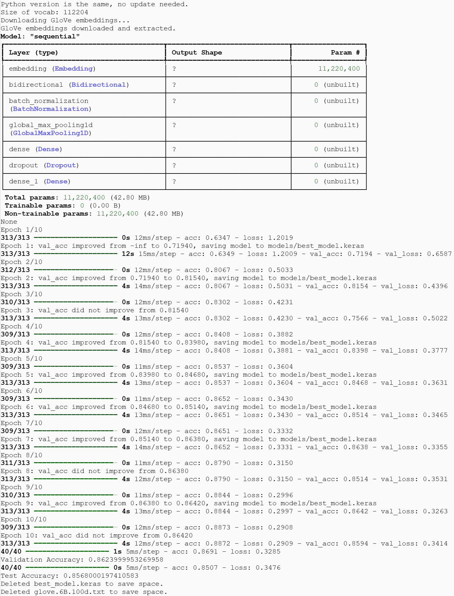

# IMDb Sentiment Classifier

This project is a sentiment classifier for IMDb movie reviews. It uses a pre-trained GloVe word embedding model and a Bidirectional LSTM network to classify reviews as positive or negative.

## Features

- Loads IMDb movie reviews for training, validation, and testing.
- Uses GloVe embeddings for enhanced text representation.
- Trains a Bidirectional LSTM model to classify reviews as positive or negative.
- Achieves high accuracy on both validation and test sets.

## Setup

1. Clone this repository:

   ```bash
   git clone https://github.com/sminerport/IMDbSentimentClassifier.git
   cd IMDbSentimentClassifier
   ```

2. Install dependencies:

   ```bash
   pip install -r requirements.txt
   ```

3. Run the model:
   ```bash
   python src/main.py
   ```

## Data

The model uses IMDb review data split into training, validation, and test sets. These files are stored in the `data/` directory and are managed with **Git Large File Storage (Git LFS)** to optimize storage and download efficiency.

To ensure access to the data files, please install **Git LFS** if you haven’t already. You can download Git LFS [here](https://git-lfs.github.com/).

```bash
# Install Git LFS
git lfs install
```

Then, clone the repository as usual:

```bash
git clone https://github.com/sminerport/IMDbSentimentClassifier.git
cd IMDbSentimentClassifier
```

If you’ve already cloned the repository without Git LFS, run the following command to pull the LFS files:

```bash
git lfs pull
```

## Usage

To train the model:

```bash
python src/main.py
```

After running, the script will automatically download and clean up GloVe embeddings to save space.

## Model Training Output

Below is a snapshot of the model's training and validation accuracy and loss across epochs:



This image provides a visual summary of the training process. Each epoch displays the model's accuracy and loss on both the training and validation sets, showing the progression as the model improves over time.

## Cleanup

The script will delete the GloVe embeddings and the saved model (`best_model.keras`) after evaluation to conserve storage. If you'd like to keep these files, set the `cleanup` variable to `False` in the script.

## Notes

- To adjust storage usage, toggle the `cleanup` variable in the script.
- `requirements.txt` is generated by running `pip freeze > requirements.txt` in a Colab environment or your local environment.

## License

This project is licensed under the MIT License. See the [LICENSE](LICENSE) file for more details.
